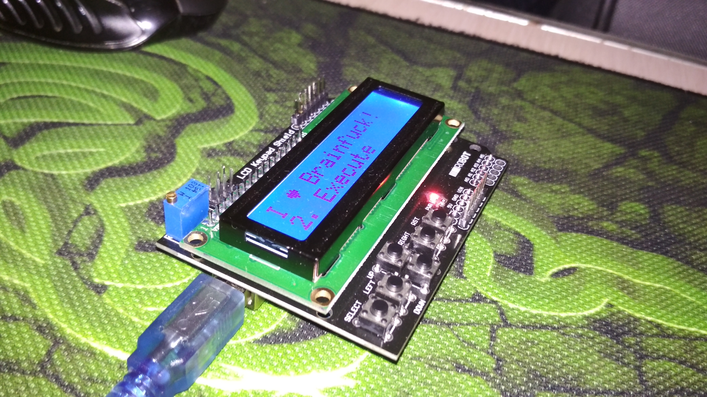

# arduino-brainfuck-interpreter
Turns Arduino Uno into a [Brainfuck](https://wikipedia.org/wiki/Brainfuck) editor and interpreter, a brainteaser for programmers.

Based on this [sketch](https://github.com/Lepeshka92/Arduino-Brainfuck-Machine) with several small fixes and improvements.

Works well with LCD Keypad Shield, however maybe need to review it's original sketch for other sets of button signal shift.

Update Jan 22 2019:
   * Added Step Execution Mode:
      - Screen 1 shows memory and a pointer to a current memory cell
      - Screen 2 shows BF program and a pointer to a program position
      - Screen 3 shows program output
      - Up/Down to switch screens
      - For screens 1 and 2 left/right to scroll
      - Select button to step
      - Program input interrupts any screen when occurs
   * Because of adding Step Execution Mode memory for BF code and memory for BF memory decreased to 128 bytes each

